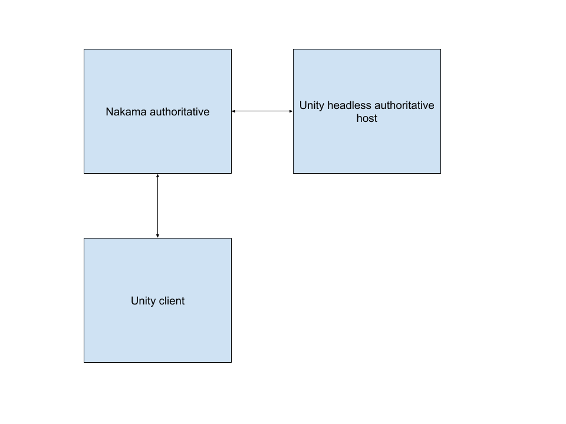

# niwrad


Along building this project & others, I'm actively writing (and reading biology books) on mixed subjects of theory of evolution, Red Queen hypothesis, Vicar of Bray hypothesis, kubernetes, go, unity: basically tinkering with evolution simulations:

* [Part one](https://medium.com/swlh/a-simulation-of-evolution-part-one-62a1acfb009a)

## How it works

[Nakama](https://github.com/heroiclabs/nakama) is used for network communication, kubernetes coordination & other stuffs.

### Architecture

Simulate physics is hard. Unity does it decently using Physx under the hood.\
It's easier to just use Unity for that instead of the Nakama server.



Under the hood Nakama is used as a coordinator to spawn kubernetes pods that handle each a specific box of the map.  
An Octree data structure is used for that.  


### Evolution

The principle is to simulate few similar key points among darwinian evolution, obviously the goal is to avoid to go too low level or over-engineer, we ain't got quantum computers !

- Life forms "hosts" that carry characteristics like every "survival machine" on our world that carry genes, these genes "manipulate" the hosts to try survive, here the concept of gene hasn't been introduced.
- Hosts can breed, when they do, they characteristics are "mixed" plus a slight randomness (mutation).
- Hosts behaviour must be generic, so we can either implement simple algorithm like state-machines, behaviour trees or go more complex like (deep) reinforcement learning.
- According to these implementations, the hosts will evolve by natural selection, some characteristics that help survival (speed ... ?) will increase, some that harm survival will decrease
- The fun part: players can do some actions that will trigger artificial selection, e.g. like we human selected the cows that produce the most milk, the goal is to implement actions that offer the possibility to influence evolution. Currently what came to my mind: any way to protect, harm, heal, feed ... some targeted hosts (high speed hosts ? big hosts ...)

## Usage

```bash
git clone https://github.com/louis030195/niwrad
```

### Prerequisites

#### Deployment

1. [Docker](https://www.docker.com)
2. [Install kubectl](https://kubernetes.io/docs/tasks/tools/install-kubectl/)
3. [Install helm](https://helm.sh/docs/intro/install/)
4. [Install minikube](https://kubernetes.io/docs/tasks/tools/install-minikube/) (for local k8s)

#### Client

1. [Unity](https://unity.com)
2. make: `sudo apt install make`
3. [protoc, protoc-gen-go, protoc-gen-csharp](https://github.com/protocolbuffers/protobuf) (optional)

```make
Usage: make [TARGET]
Targets:
  build                 build unity client, docker images and protobufs
  build-client          build unity client
  build-images          build docker images
  build-proto           build protobuf stubs
  deploy                deploy cluster
  client                launch Linux client
```

So i propose that you just deploy & run client:

```bash
make deploy
make client
```

### TODO

* [ ] Implement "robot": a creature that will tweak evolution according to our will, e.g. "I want fast animals" it will kill all slow animals\
    Basically anything that can allow players to apply artificial selection
* [ ] finish github workflow (github page deployment)
* [ ] Android controller
* [ ] Deploy persistent, resilient, fenced server on the cloud
